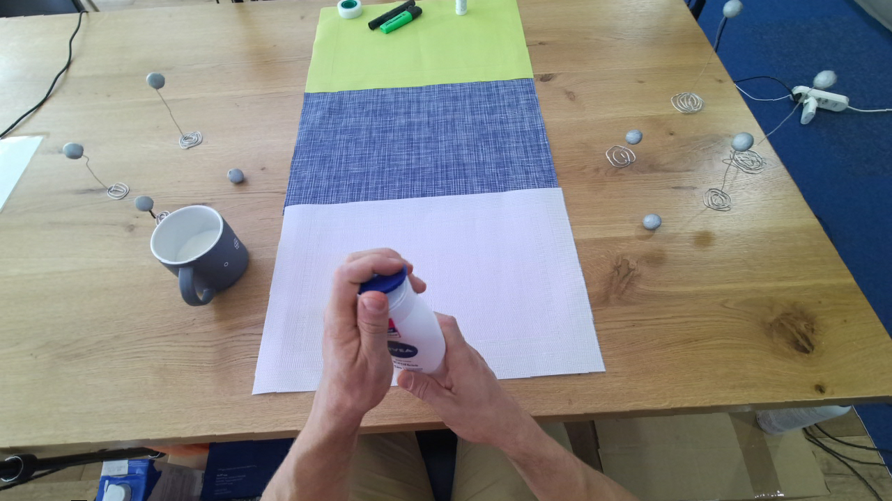

# Transformer-based Unified Recognition of Two Hands Manipulating Objects 

Official code of **[Transformer-based Unified Recognition of Two Hands Manipulating Objects](https://openaccess.thecvf.com/content/CVPR2023/papers/Cho_Transformer-Based_Unified_Recognition_of_Two_Hands_Manipulating_Objects_CVPR_2023_paper.pdf)**

[Hoseong Cho](https://sites.google.com/view/hoseong), Chanwoo Kim,  Jihyeon Kim, Seongyeong Lee, Elkhan Ismayilzada, [Seungryul Baek](https://sites.google.com/site/bsrvision00/)

|Input|Pose|Contact|
|:---:|:---:|:---:|
||||
||||
||||

# Installation
```
https://github.com/chohoseong/H2OTR.git
```
```
conda install pytorch==1.7.1 torchvision==0.8.2 torchaudio==0.7.2 cudatoolkit=11.0 -c pytorch
pip install -r requirements.txt
```
Compiling CUDA operators
```
cd ./models/ops
sh ./make.sh
```
Register and download [MANO](https://mano.is.tue.mpg.de/index.html) model.
```
.H2OTR
├── AIK
├── config
├── mano
├── manopth
├── models
├── README.md
├── demo.py
├── requirements.txt
...
```


# Data Preparation
Please download [FPHA](https://guiggh.github.io/publications/first-person-hands/), [H2O](https://taeinkwon.com/projects/h2o/) datasets.

# Inference
```
python demo.py \
        --dataset_file H2O \
        --pretrained_model weights/H2O.pth \
        --vid_id 9
```
# Citation
```
@inproceedings{cho2023transformer,
  title={Transformer-Based Unified Recognition of Two Hands Manipulating Objects},
  author={Cho, Hoseong and Kim, Chanwoo and Kim, Jihyeon and Lee, Seongyeong and Ismayilzada, Elkhan and Baek, Seungryul},
  booktitle={Proceedings of the IEEE/CVF Conference on Computer Vision and Pattern Recognition},
  pages={4769--4778},
  year={2023}
}
```
